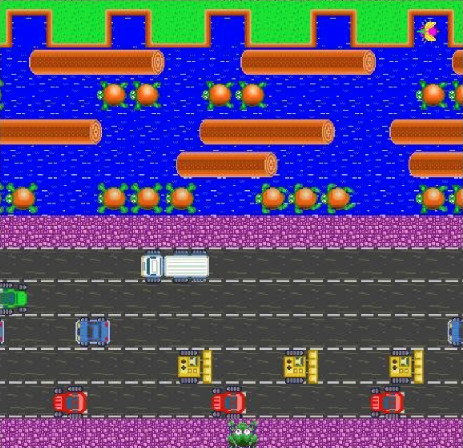
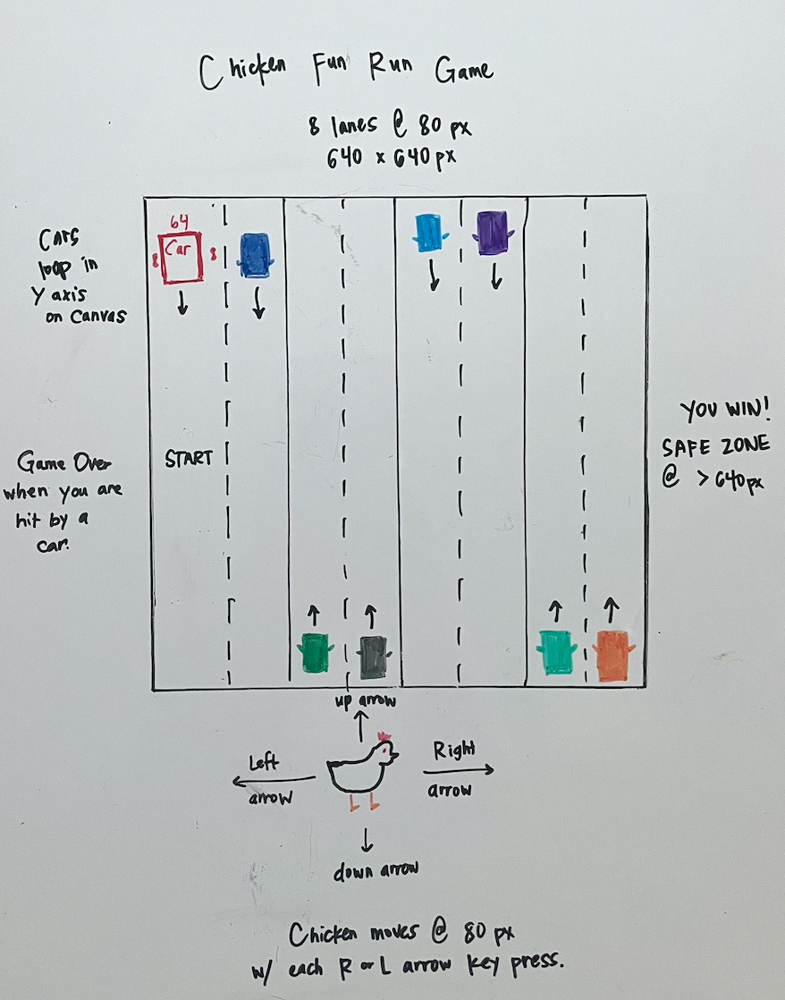

# Chicken-Fun-Run-game

Why did the chicken cross the road? 
To get to the other side!

Chicken Fun Run is just like the classic arcade game "Frogger."  Sure to be a classic among retro gaming enthusiasts!

Haven't heard of "Frogger"? No worries, it's simple.  The player controls a chicken who must navigate through a busy road to reach home on the other side.  The player has to avoid oncoming cars that move across the screen.  

The game is played on a 2D platform with the chicken at one side of the screen with the obstacles moving from bottom to top.  The player must move the chicken forward and backward, left and right, to avoid getting hit by the cars and make it safely to the other side.  Reach the other side and you win an intentionally corny, cheesy, and predictable dad joke that will be sure to elicit a groan or a chuckle. Why? Because games are supposed to be fun, and chickens eat corn.   

To play, use your keyboard arrows to move the chicken up and down, left and right. 

# HOW TO PLAY
1. Click the Start Game Button to start the game.
2. Use the arrow keys to move the chicken right, left, up and down.
3. Move the chicken across the road to the right while dodging the oncoming cars. 
4. Make it across the road and off the streets to win!
5. If you are hit by a car, there will be a pop-up indicating the game is over.
6. Click the "OK" button to restart the game and try again. 
7. Play again for another dad joke. 

# FUTURE ENHANCEMENTS
* Adding levels to the game to increase difficulty getting the chicken across the road
* Levels may include:
    * More cars on the road
    * Multiple cars in each lane
    * Cars moving at a faster pace across the road
* Chicken with multiple lives
* Option to pause the game
* Add a timer to the game
* Food or coins for the chicken to collect for points
* Sound effects and music
* Background image
* Gifs for the chicken when moving 

# LICENSE
(CC0 1.0 Universal) You're free to use this game and code in any project, personal or commercial. There's no need to ask permission before using these. Giving attribution is not required, but is appreciated.

# INITIAL SKETCH

# CREDITS
* Sprites were created on Piskelapp.com/p/create/sprite 
* Ethan Paiva created the chicken image
* Scott Bruce, a software engineer friend provided me with guidance getting through any blocks
* Learn JavaScript by Building 7 Games: https://www.youtube.com/watch?v=ec8vSKJuZTk
* https://www.w3schools.com/js/

